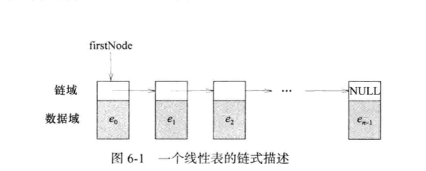

### 线性表——链式描述

#### **概述**
链表中，线性表的元素在内存中的存储位置是随机的。
- 链式描述
- 链表，循环表，双向链表
- 头节点

STL的容器类`list`使用带有头节点的双向循环链表来描述实例。与`vector`方法类似。

#### 单向链表
##### 描述
线性表每一个元素用节点来描述，**节点**可以不是数组成员。节点明确包含另一个相关节点的位置信息，这个信息称为**链(link)**或**指针(pointer)**。

#### 结构chainNode
```c++
template <class T>
struct chainNode
{
//  数据成员
T element;
chainNode<T> *next;

// 方法
chainNode() {}
chainNode(const T& element) {this->element = element;}
chainNode(const T& element, chainNode<T>* next) {
    this->element  = element;
    this->next = next; 
}
```
#### 类chain
1. 链表 chain 的方法 header, empty 和 size

类 chain 用单向链表实现了线性表,最后一个节点的指针域为NULL，即它用单向链表的一组节点实现了线性表。
```c++
template<class T>
class chain:public linerLiat<T>
{
    public:
    // 构造函数，复制构造函数和析构函数
    chain(int initialCapacity = 10);
    chain(const chain<T>&);
    ~chain();
    
    //抽象数据类型ADT的方法
    bool empty() const {return listSize == 0;}
    int size() const {return listSize;}
    T& get(int theIndex) const;
    int indexOf(const T& theElement) const;
    void erase(int theIndex);
    void insert(int theIndex, const T& theElement);
    void output(ostream& out) const;
    protected:
    void checkIndex(int theIndex) const;
    // 如果索引无效，抛出异常
    chainNode<T>* firstNode; //指向链表第一个节点的指针
    int listSize; //线性表的元素个数
    
};
```

2. 